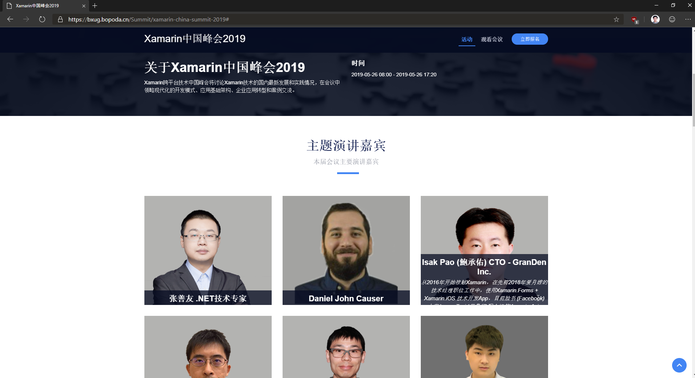

# Personal Software development related History

## Contact Info

- First Name : Chen-Yu
- Last Name : Pao
- Email : windperson@msn.com

## Activities

### Speaking (Conference)

- COSCUP 2017 `(2017/08/06)`:  
  Go,Java,C# 的 gRPC + Protocol Buffer 共同大亂鬥  
  <http://coscup.org/2017/#/schedule/day2/3061450>  
  slide: <https://www.slideshare.net/ChenYuPao/go-java-cgrpcprotocol-buffer>
- MonkeyFest 2018 - Global Xamarin Bootcamp in Taipei `(2018/11/10)`:  
  FP(Functional Programming) on Xamarin 入門  
  https://www.facebook.com/events/302396750321401  
  https://www.accupass.com/go/monkeyfest18taipei  
  
- 2019 Xamarin 移动跨平台技术中国峰会 `(2019/05)`:  
  Xamarin watchOS开发第一步  
  
- .NET Conf 2020 By study4 (2020/12/18):  
  HoloLens 2的 MR（Mixed Reality）開發入門  
  https://dotnetconf2020.study4.tw/Speaker#BaoChengyou  
  

### Speaking (User group/Lighting talk)

- Golang Taipei Gathering #28 (2017/10/24): Proto.Actor"串接Go與C#簡易上手  
  <https://golang.kktix.cc/events/gtg28>  
  slide: <https://www.slideshare.net/ChenYuPao/proto-actor-go-c-81145090>

- Xamarin社群小聚 #1 (2018/01/31): Xamarin 的 Azure 後端懶人包  
  <https://www.facebook.com/events/160179314705298/>  
  slide: <https://1drv.ms/p/s!AoyN1fhOtyhr7rkmJC9dZNAn8JOuGA>

- Xamarin社群小聚 #2 (2018/02/28): Xamarin.Forms 之「Native Forms」混合協奏一部曲  
  <https://www.facebook.com/events/1958348087815948/>  
  slide: <https://1drv.ms/p/s!AoyN1fhOtyhr7sh4tp6fxcDnT6mD9Q>

- Xamarin社群小聚 #3 (2018/03/28): Xamarin.Forms 之 MVVMCross v.s. Prism 對抗戰  
  <https://www.facebook.com/events/574129212938073/>  
  slide: <https://1drv.ms/p/s!AoyN1fhOtyhr7s5TR2_kax0nddmpMQ>

- Xamarin社群小聚 #4 (2018/04/25): Xamarin 手機AR開發入門初體驗 — iOS ARKit  
  <https://www.facebook.com/events/2063683477183946>  
  slide: <https://1drv.ms/p/s!AoyN1fhOtyhr7tVKR43JBbedGJAUFw>

- Study4TW-May-2018 (2018/05/26): ASP.NET Core 新手上路的七個路坑  
  <http://study4.tw/Activity/Details/17>  
  slide: <https://1drv.ms/p/s!AoyN1fhOtyhr7t4mexgtF5ou6lVbsg>

- Xamarin社群小聚 #5 (2018/05/30): 用 Rider 開發 Xamarin App  
  <https://www.facebook.com/events/237778106971884/>  
  slide: <https://1drv.ms/p/s!AoyN1fhOtyhr7t4xdkIF-UhUjJW_mQ>

- Xamarin社群小聚 #6 (2018/07/04): ASP.NET Core SignalR & Xamarin.Forms  
  <https://www.facebook.com/events/152534075606566/>  
  slide: <https://1drv.ms/p/s!AoyN1fhOtyhr7uQ4u0VVdDZUE4ofWA>

- Hacking Thursday Taiwan (2018/07/11): ASP.NET Core 帶您讀源碼 - WebSocket 篇  
  <https://www.meetup.com/hackingthursday/events/251470731/>  
  slide: <https://1drv.ms/p/s!AoyN1fhOtyhr7uVaT-GXg4Yx4Q5pdA>

- Xamarin社群小聚 #7 (2018/08/01): Reactive UI 與 Xamarin.Forms 的整合運用  
  <https://www.facebook.com/events/996901387138892>  
  slide: <https://1drv.ms/p/s!AoyN1fhOtyhr7uV6hlF8g4RSE_jNgg>
  
- Xamarin社群小聚 #8 (2018/08/30): SkiaSharp 在 Xamarin.Forms 的巧妙應用  
  <https://www.facebook.com/events/1930666830559894>  
  slide: <https://1drv.ms/p/s!AoyN1fhOtyhr7uYIM576KATdT9HZbw>

- Study4.TW .NET Conf 2018 (2018/09/29): ASP.NET Core 如何串接Azure AD B2C驗證機制  
  <http://study4.tw/Activity/Details/20>  
  slide: <https://1drv.ms/p/s!AoyN1fhOtyhr7vUeuj6LBfAm0opEXA>

- Xamarin社群小聚 #9 (2018/10/03): Xamarin 串接 Azure B2C 服務  
  <https://www.facebook.com/events/224289281779289>  

### Open Source Project(s) contribution

- ASP.NET Core SignalR(<https://github.com/aspnet/signalr>)  
  Pull Requests:  
  <https://github.com/aspnet/SignalR/pull/2542>  
  Issues:  
  <https://github.com/aspnet/SignalR/issues/2597>

### Code Project/Tools

- A forked websocket client library of WebSocketSharp that is shrinked size for client only and .NET Standard 2.0 compatible:
  <https://github.com/GranDen-Corp/websocket-sharp_client>

### Code Samples

- Showing using APM async is not support in .Net Core:  
  <https://github.com/windperson/NetCoreIncompatibleDemo>

- ASP.NET Core 2.x websocket and signalR server RPC demo:  
  <https://github.com/windperson/aspnet_websocket_sample>

- Demo using MassTransmit (<http://masstransit-project.com>) running on .net Core:  
  <https://github.com/windperson/MassTransit_Demo>

- Demo using moq on xUnit test project:  
  <https://github.com/windperson/DemoMoqAndXunit>

- Demo using docker to run .NET Core test project:  
  <https://github.com/windperson/demo_docker_dotnetcore_test>

- Deom using .Net Core 2.1 HostBuilder to create a daemon-like service:  
  <https://github.com/windperson/NetCoreHostBuilder_demo>

- Demo to show how to use "ClientWebSocket" API:  
  <https://github.com/windperson/netcore_clientwebsocket>

- Xamarin.Android ARCore example project:  
  <https://github.com/windperson/Xamarin_ARCore_HelloAR>

- A example to show how to write a MVVM UI pattern app purely by Xamarin Forms without using the MVVM frameworks library:  
  <https://github.com/windperson/MVVMbyHand>

- The MVVMbyHand example implemented using Prism for Xamarin Forms:  
  <https://github.com/windperson/PrismMVVMbyHand>

- Demo how to access android Context in Xamarin Form 2.5 and above:  
  <https://github.com/windperson/XamarinFormAndroidContextDemo>

- A Xamarin iOS project to demonstrate Background Fetch:  
  <https://github.com/windperson/Xamarin-iOS-BackgroundFetchDemo>

- Demo using iOS "Background Transfer Service" in Xamarin iOS project:  
  <https://github.com/windperson/Xamarin-iOS-BackgroundTransferServiceDemo>

- Demonstrate Xamarin.Forms Embedding, or called "Xamarin.Forms Native Forms" in Xamarin.iOS / Xamarin.Android project:  
  <https://github.com/windperson/XamarinForms-Embedded>

- Demo project using MediaManager for Xamarin to play video on Xamarin project:  
  <https://github.com/windperson/Xamarin-Play-Video-Demo>

- Demo using ReactiveUI on Xamarin.Forms project:  
  <https://github.com/windperson/ReactiveUIdemo>

- Demo using Rx in Xamarin.Forms handling UI Event:  
  <https://github.com/windperson/ReativeEventDemo>

- Demo using Rx to build better search auto suggest list:  
  <https://github.com/windperson/ReativeAsyncAwaitDemo>

- A demo solution to show how to use .net standard library all around:  
  <https://github.com/windperson/NetStandard_use_demo>

- A demo modify from the <https://adrianhall.github.io/develop-mobile-apps-with-csharp-and-azure/> using .net standard class library sharing DTO type:  
  <https://github.com/windperson/Xamarin_AzureMobileApp_Demo>

- Various Xamarin Workbooks sample code to demo C# Async/Await, JSON.NET library usage,  SmartFormat.NET library usage:  
  <https://github.com/windperson/xamarin_workbooks>

- GTG #28 lighting talk demo using Proto.Actor to let .net Core C# instance communicate with Golang:  
  <https://github.com/windperson/gtg28-protoactor-demo>
