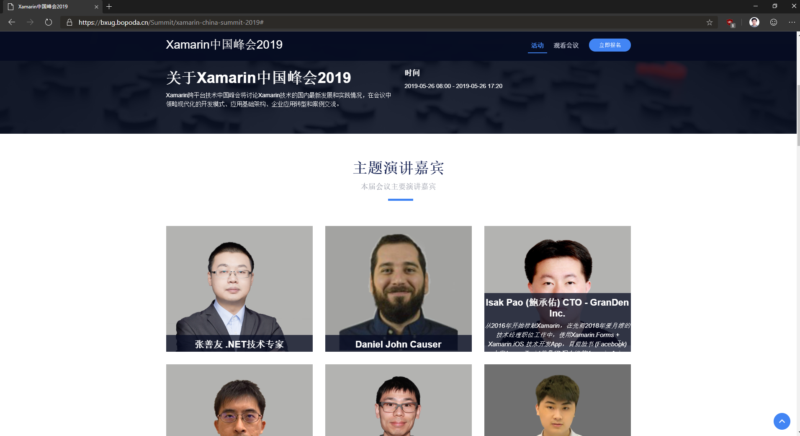
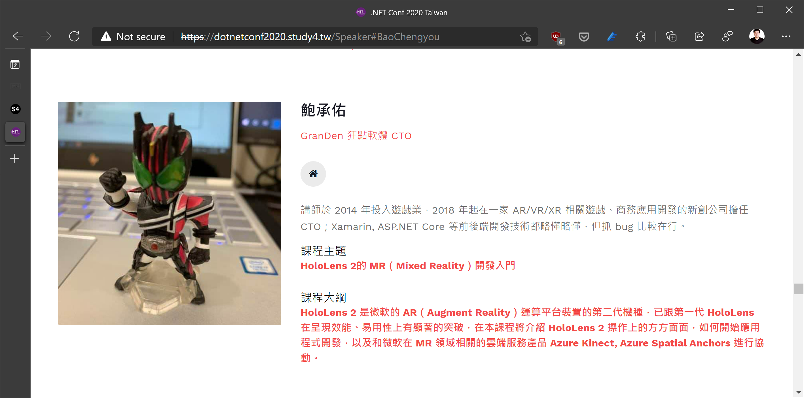
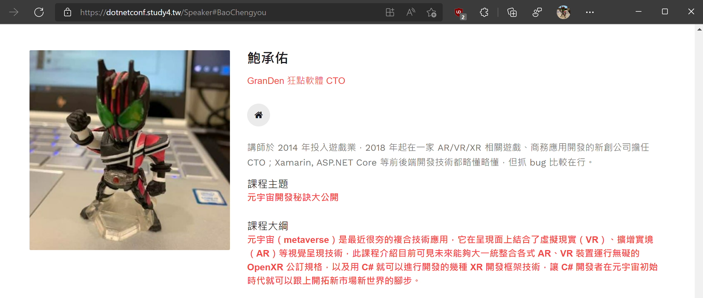

# Personal Software development related History

## Contact Info

- First Name : Isak
- Last Name : Pao
- Online Contact Info : <https://linktr.ee/windperson>

## Activities

### Speaking (Conference)

- `(2017/08/06)` COSCUP 2017:  
  Go,Java,C# 的 gRPC + Protocol Buffer 共同大亂鬥  
  <http://coscup.org/2017/#/schedule/day2/3061450>  
  slide: <https://www.slideshare.net/ChenYuPao/go-java-cgrpcprotocol-buffer>
- `(2018/11/10)` MonkeyFest 2018 - Global Xamarin Bootcamp in Taipei :  
  FP(Functional Programming) on Xamarin 入門  
  https://www.facebook.com/events/302396750321401  
  https://www.accupass.com/go/monkeyfest18taipei  
  
- `(2019/05/26)` 2019 Xamarin 移动跨平台技术中国峰会:  
  Xamarin watchOS开发第一步  
  <https://blog.csdn.net/sD7O95O/article/details/90526403>
  
- `(2020/12/19)` .NET Conf 2020 By study4TW:  
  HoloLens 2的 MR（Mixed Reality）開發入門  
  <https://dotnetconf2020.study4.tw/Speaker#BaoChengyou>
  
- `(2021/12/18)` .NET Conf 2021 By study4TW:  
  元宇宙開發秘訣大公開
  <https://dotnetconf.study4.tw/Speaker#BaoChengyou>
  

### Speaking (User group meetup / Conf Lighting talk)

- `(2017/10/24)` Golang Taipei Gathering #28: Proto.Actor"串接Go與C#簡易上手  
  <https://golang.kktix.cc/events/gtg28>  
  slide: <https://www.slideshare.net/ChenYuPao/proto-actor-go-c-81145090>

- `(2018/01/31)` Xamarin Asia Developers社群小聚2018 #01: Xamarin 的 Azure 後端懶人包  
  <https://www.facebook.com/events/160179314705298/>  
  slide: <https://1drv.ms/p/s!AoyN1fhOtyhr7rkmJC9dZNAn8JOuGA>

- `(2018/02/28)` Xamarin Asia Developers社群小聚2018 #02: Xamarin.Forms 之「Native Forms」混合協奏一部曲  
  <https://www.facebook.com/events/1958348087815948/>  
  slide: <https://1drv.ms/p/s!AoyN1fhOtyhr7sh4tp6fxcDnT6mD9Q>

- `(2018/03/28)` Xamarin Asia Developers社群小聚2018 #03: Xamarin.Forms 之 MVVMCross v.s. Prism 對抗戰  
  <https://www.facebook.com/events/574129212938073/>  
  slide: <https://1drv.ms/p/s!AoyN1fhOtyhr7s5TR2_kax0nddmpMQ>

- `(2018/04/25)` Xamarin Asia Developers社群小聚2018 #04: Xamarin 手機AR開發入門初體驗 — iOS ARKit  
  <https://www.facebook.com/events/2063683477183946>  
  slide: <https://1drv.ms/p/s!AoyN1fhOtyhr7tVKR43JBbedGJAUFw>

- `(2018/05/26)` Study4TW-May-2018: ASP.NET Core 新手上路的七個路坑  
  <http://study4.tw/Activity/Details/17>  
  slide: <https://1drv.ms/p/s!AoyN1fhOtyhr7t4mexgtF5ou6lVbsg>

- `(2018/05/30)` Xamarin Asia Developers社群小聚2018 #05: 用 Rider 開發 Xamarin App  
  <https://www.facebook.com/events/237778106971884/>  
  slide: <https://1drv.ms/p/s!AoyN1fhOtyhr7t4xdkIF-UhUjJW_mQ>

- `(2018/07/04)` Xamarin Asia Developers社群小聚2018 #06: ASP.NET Core SignalR & Xamarin.Forms  
  <https://www.facebook.com/events/152534075606566/>  
  slide: <https://1drv.ms/p/s!AoyN1fhOtyhr7uQ4u0VVdDZUE4ofWA>

- `(2018/07/11)` Hacking Thursday Taiwan: ASP.NET Core 帶您讀源碼 - WebSocket 篇  
  <https://www.meetup.com/hackingthursday/events/251470731/>  
  slide: <https://1drv.ms/p/s!AoyN1fhOtyhr7uVaT-GXg4Yx4Q5pdA>

- `(2018/08/01)` Xamarin Asia Developers社群小聚2018 #07: Reactive UI 與 Xamarin.Forms 的整合運用  
  <https://www.facebook.com/events/996901387138892>  
  slide: <https://1drv.ms/p/s!AoyN1fhOtyhr7uV6hlF8g4RSE_jNgg>
  
- `(2018/08/30)` Xamarin Asia Developers社群小聚2018 #08: SkiaSharp 在 Xamarin.Forms 的巧妙應用  
  <https://www.facebook.com/events/1930666830559894>  
  slide: <https://1drv.ms/p/s!AoyN1fhOtyhr7uYIM576KATdT9HZbw>

- `(2018/09/29)` Study4.TW .NET Conf 2018: ASP.NET Core 如何串接Azure AD B2C驗證機制  
  <http://study4.tw/Activity/Details/20>  
  slide: <https://1drv.ms/p/s!AoyN1fhOtyhr7vUeuj6LBfAm0opEXA>

- `(2018/10/03)` Xamarin Asia Developers社群小聚2018 #09: Xamarin 串接 Azure B2C 服務  
  <https://www.facebook.com/events/224289281779289>  

- `(2018/12/12)` Xamarin Asia Developers社群小聚2018 #10: Artificial Intelligence(AI) on Xamarin.Forms Part-1  
  <https://www.facebook.com/events/270896696894065>

- `(2019/01/09)` Xamarin Asia Developers社群小聚2019 #01: Artificial Intelligence(AI) on Xamarin.Forms Part-2  
  <https://www.facebook.com/events/2208494779415338>

- `(2019/02/16)` twMVC#34 lighting talk: ASP.NET Core SignalRwithMicrosoft Orleans  
  <https://mvc.tw/event/2019/2/16>  
  slide: <https://1drv.ms/p/s!AoyN1fhOtyhr7vlokHoTKW-NeNW1NA>

- `(2019/03/06)` Xamarin Asia Developers社群小聚2019 #02: F# 與 MVU框架Fabulus 在 Xamarin 當中的使用介紹   
  <https://www.facebook.com/events/325957884704810>  
  demo project: https://github.com/windperson/MyFabulousDemo

- `(2019/03/23)` Xamarin Asia Developers線上直播小聚2019 #03: Xamarin watchOS App開發入門  
  <https://www.facebook.com/events/1997622796942258>  
  slide: <https://1drv.ms/p/s!AoyN1fhOtyhr74Q-ogJx2eu7TuSSrA?e=5IDIyq>

- `(2019/05/01)` Xamarin Asia Developers線上直播小聚2019 #04: Material Design by Xamarin.Forms   
  <https://www.facebook.com/events/1188162584690642>  
  slide: <https://1drv.ms/p/s!AoyN1fhOtyhr74gxy13cSdXA9wibVg?e=jrFfiV>

- `(2019/06/15)` Xamarin Asia Developers線上直播小聚2019 #05: Xamarin.Forms Fast Renderer   
  <https://www.facebook.com/events/606910123140947>  
  slide: <https://1drv.ms/p/s!AoyN1fhOtyhr74t056DRhV9shVAxbg?e=XPrcwG>

- `(2019/07/20)` Xamarin Asia Developers社群小聚2019 #06 實體小聚: Azure PlayFab with Xamarin  
  <https://www.facebook.com/events/348868105775697>  
  slide: <https://1drv.ms/p/s!AoyN1fhOtyhr7415vEgBdQqXNVEHKA?e=2xpRkA>

- `(2019/08/31)` Xamarin Asia Developers線上直播小聚2019 #07: 在 Xamarin.Forms 上實現 Machine Learning 應用   
  <https://www.facebook.com/events/2577461629148252>  
  slide: <https://1drv.ms/p/s!AoyN1fhOtyhr745W-0LFH3kEwUSMhg?e=gjyI9t>

- `(2019/10/05)` Xamarin Asia Developers線上直播小聚2019 #08: Xamarin 語音辨識 with Native Platform or Azure  
  <https://www.facebook.com/events/364951457792556>  
  slide: <https://1drv.ms/p/s!AoyN1fhOtyhr75EVCA9f9Me_XwctdQ?e=nCBYKY>

- `(2019/11/30)` Xamarin Asia Developers線上直播小聚2019 #09: MonoGame Introduction  
  <https://www.facebook.com/events/403391487207077>  
  slide: <https://1drv.ms/p/s!AoyN1fhOtyhr75V46XBxd6fg6OG9QA?e=Cmtbnc>

- `(2019/12/27)` DDD Taiwan 12月聚會：ddd 在 .NET Core 上的另類實現 - Orleans  
  <https://www.facebook.com/events/453492625566230>  
  slide: <https://1drv.ms/p/s!AoyN1fhOtyhr75YTl7071ej6MLNgMA?e=hIbFOU>

- `(2020/01/18)` Xamarin Asia Developers線上直播小聚2020 #01: How to Use Icon Fonts in Xamarin.Forms  
  <https://www.facebook.com/events/403391487207077>  
  slide: <https://1drv.ms/p/s!AoyN1fhOtyhr75YkcooaFN0HkNMsGQ?e=Eqw1NG>

- `(2021/01/30)` XADs 社群 2021 #01 活動: Azure Spatial Anchor 在Xamarin 與 HoloLens2 的 AR 應用展示  
  <https://www.facebook.com/events/777138102880365>  
  slide: <https://1drv.ms/p/s!AoyN1fhOtyhr7_kdz9FXTsbYTrbIHQ>

- `(2021/03/06)` twMVC#41: HoloLens 2的 MR（Mixed Reality）開發入門  
  <https://mvc.tw/event/2021/3/6>  
  slide: <https://www.slideshare.net/twMVC/twmvc41-hololens2-mr>

- `(2021/04/07)` Azure Taiwan Meetup #39: Azure Spatial Anchors 空間定位服務簡介  
  <https://www.meetup.com/Azure-Taiwan/events/276415654>  
  slide: <https://1drv.ms/p/s!AoyN1fhOtyhr8JpMa3bLg9vJdg_g7A>

- `(2021/04/17)` XADs 社群 2021 #02 活動: iOS 14 Widgets with Xamarin Forms  
  <https://www.facebook.com/events/196017905347380>  
  slide: <https://1drv.ms/p/s!AoyN1fhOtyhr8Jsu_WDjvKDdEJI-9g>

- `(2021/05/08)` XADs 社群 2021 #03 活動: Android App Widgets with Xamarin Forms  
  <https://www.facebook.com/events/381026323329933>  
  slide: <https://1drv.ms/p/s!AoyN1fhOtyhr8JxphjKdChBhcJ7Zyg?e=M6htnI>

- `(2021/06/16)` Will 保哥的技術交流中心: 使用 Orleans 開發分散式系統不費力  
  <https://www.facebook.com/events/313397287129422/>  
  slide: <https://1drv.ms/p/s!AoyN1fhOtyhr8J1rh7vmbfq_ru_lKA>

- `(2021/07/18)` MR/XR Developers 社群 2021 #1 活動：介紹幾種分享HoloLens App應用呈現畫面的方法以及Holographic Remoting簡介  
  <https://www.facebook.com/events/2643830632587053/>  
  slide: <https://1drv.ms/p/s!AoyN1fhOtyhr8KAuxUOXuUhKGP8xPg>

- `(2021/11/06)` XADs 社群 2021 #04 活動：Stride - Build your 3D Game by Xamarin    
  <https://www.facebook.com/events/391288129313021/>  
  slide: <https://1drv.ms/p/s!AoyN1fhOtyhr8LAo6pDjzXoZ0awwaQ>

### Open Source Project(s) contribution

- ASP.NET Core SignalR(<https://github.com/aspnet/signalr>)  
  Pull Requests:  
  <https://github.com/aspnet/SignalR/pull/2542>  
  Issues:  
  <https://github.com/aspnet/SignalR/issues/2597>

- Orleans(<https://github.com/dotnet/orleans>)
  Issue provide project upgrade troubleshooting result:  
  <https://github.com/dotnet/orleans/issues/6393#issuecomment-598133947>

### Code Project/Tools

- BlazorSwitchButton: A open source Blazor UI Component thate package the traditional Bootstrap component [Bootstrap Switch Button](https://gitbrent.github.io/bootstrap-switch-button/).  
  Source: <https://github.com/GranDen-Corp/BlazorSwitchButton>  
  Intro: <https://www.facebook.com/groups/blazor/permalink/1437738953100182>

- A forked websocket client library of WebSocketSharp that is shrinked size for client only and .NET Standard 2.0 compatible:
  <https://github.com/GranDen-Corp/websocket-sharp_client>

### Code Samples

- Showing using APM async is not support in .Net Core:  
  <https://github.com/windperson/NetCoreIncompatibleDemo>

- ASP.NET Core 2.x websocket and signalR server RPC demo:  
  <https://github.com/windperson/aspnet_websocket_sample>

- Demo using MassTransmit (<http://masstransit-project.com>) running on .net Core:  
  <https://github.com/windperson/MassTransit_Demo>

- Demo using moq on xUnit test project:  
  <https://github.com/windperson/DemoMoqAndXunit>

- Demo using docker to run .NET Core test project:  
  <https://github.com/windperson/demo_docker_dotnetcore_test>

- Demo using .Net Core 2.1 HostBuilder to create a daemon-like service:  
  <https://github.com/windperson/NetCoreHostBuilder_demo>

- Demo to show how to use "ClientWebSocket" API:  
  <https://github.com/windperson/netcore_clientwebsocket>

- Xamarin.Android ARCore example project:  
  <https://github.com/windperson/Xamarin_ARCore_HelloAR>

- A example to show how to write a MVVM UI pattern app purely by Xamarin Forms without using the MVVM frameworks library:  
  <https://github.com/windperson/MVVMbyHand>

- The MVVMbyHand example implemented using Prism for Xamarin Forms:  
  <https://github.com/windperson/PrismMVVMbyHand>

- Demo how to access android Context in Xamarin Form 2.5 and above:  
  <https://github.com/windperson/XamarinFormAndroidContextDemo>

- A Xamarin iOS project to demonstrate Background Fetch:  
  <https://github.com/windperson/Xamarin-iOS-BackgroundFetchDemo>

- Demo using iOS "Background Transfer Service" in Xamarin iOS project:  
  <https://github.com/windperson/Xamarin-iOS-BackgroundTransferServiceDemo>

- Demonstrate Xamarin.Forms Embedding, or called "Xamarin.Forms Native Forms" in Xamarin.iOS / Xamarin.Android project:  
  <https://github.com/windperson/XamarinForms-Embedded>

- Demo project using MediaManager for Xamarin to play video on Xamarin project:  
  <https://github.com/windperson/Xamarin-Play-Video-Demo>

- Demo using ReactiveUI on Xamarin.Forms project:  
  <https://github.com/windperson/ReactiveUIdemo>

- Demo using Rx in Xamarin.Forms handling UI Event:  
  <https://github.com/windperson/ReativeEventDemo>

- Demo using Rx to build better search auto suggest list:  
  <https://github.com/windperson/ReativeAsyncAwaitDemo>

- A demo solution to show how to use .net standard library all around:  
  <https://github.com/windperson/NetStandard_use_demo>

- A demo modify from the <https://adrianhall.github.io/develop-mobile-apps-with-csharp-and-azure/> using .net standard class library sharing DTO type:  
  <https://github.com/windperson/Xamarin_AzureMobileApp_Demo>

- Various Xamarin Workbooks sample code to demo C# Async/Await, JSON.NET library usage,  SmartFormat.NET library usage:  
  <https://github.com/windperson/xamarin_workbooks>

- GTG #28 lighting talk demo using Proto.Actor to let .net Core C# instance communicate with Golang:  
  <https://github.com/windperson/gtg28-protoactor-demo>
